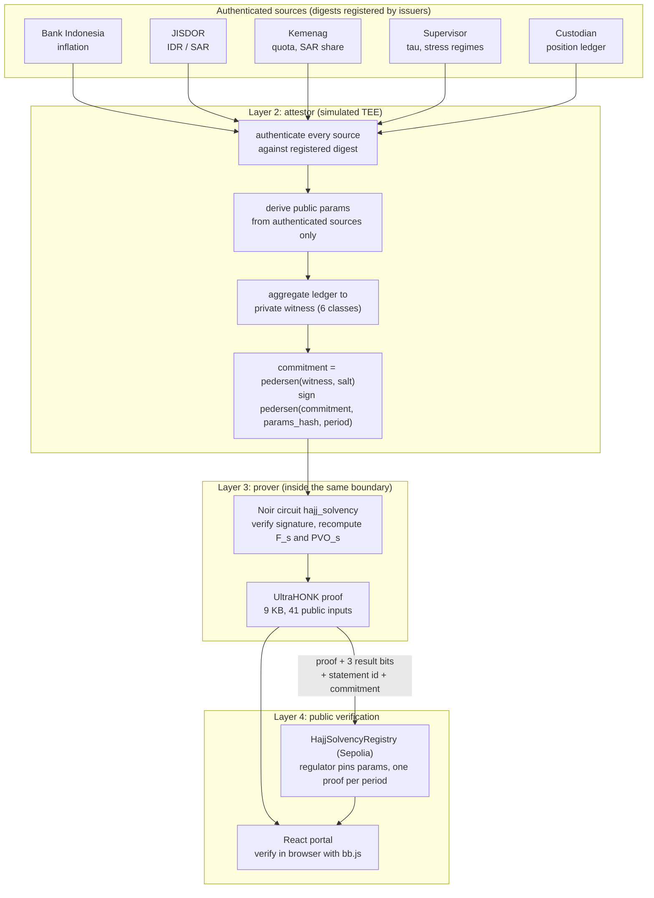

# Architecture

## Data flow

Everything left of the arrow into Layer 4 stays inside the enclave boundary: the ledger, the aggregated witness, the salt, F_s and PVO_s.
`POST /attest-and-prove` returns only the proof bundle, never the witness.

## Trust boundaries

| Party | Trusted for | Not trusted for |
| --- | --- | --- |
| Source issuers (BI, JISDOR, Kemenag, supervisor, custodian) | The truth of their own documents | – |
| Attestor / TEE | Authenticating inputs, honest aggregation, key custody | In production this is the main trust anchor; see threat model |
| Prover (BPKH) | Nothing | Cannot alter inputs, scenarios, period or attestor without invalidating the proof |
| Regulator | Pinning correct public parameters and attestor key hash per period | – |
| Verifier (anyone) | Nothing | – |

## Public inputs (41)

`packages/prover/src/encoding.ts` (`PUBLIC_INPUT_LAYOUT`) and `HajjSolvencyRegistry.sol` share this layout.

| Index | Field | Kind |
| --- | --- | --- |
| 0 | `period_id` | parameter |
| 1 – 4 | `fx_base`, `quota`, `sar_share_bps`, `tau_bps` | parameter |
| 5 – 16 | `inflation_bps[3]`, `fx_idr_per_sar[3]`, `discount_bps[3]`, `yield_shock_bps[3]` | parameter |
| 17 – 34 | `haircut_bps[3][6]` | parameter |
| 35 | `attestor_key_hash` | parameter |
| 36 – 38 | `result_bits[3]` | **output**: 1 iff SR_s ≥ τ |
| 39 | `statement_id` | **output**: replay nullifier |
| 40 | `commitment` | **output**: hiding commitment to the witness |

The verifier contract additionally consumes 8 pairing-point limbs that Barretenberg embeds in the proof (49 in total).

## Components

* **`packages/solvency-model`**: float model for reporting; `computeFixed` is a `BigInt` mirror of the circuit used for differential testing.
  Fixed point at 10 000 (basis points); obligations round up, assets round down.
* **`packages/attestor`**: `SimulatedEnclave` (authentication, aggregation, signing, `report`), Hono HTTP API, Dockerfile, `phala.config.json`.
* **`circuits/hajj_solvency`**: `model.nr` (arithmetisation and range checks), `attest.nr` (commitment, params hash, key hash, ECDSA verification),
  `main.nr` (wiring). Compiled with `noir_wasm`; the artifact and verification key are committed.
* **`packages/prover`**: compile, witness (`noir_js`), prove/verify (`bb.js`), proof bundle format, CLIs, Solidity verifier export.
* **`contracts`**: generated `HonkVerifier` and `HajjSolvencyRegistry` (`REGULATOR_ROLE` pins parameters, `PROVER_ROLE` submits, everyone reads and re-verifies).
  Holds no funds, has no `payable` entrypoint, cannot delete or overwrite records.
* **`apps/portal`**: lists proofs, verifies them in the browser against `vk_evm` using a 1 KB public SRS (no CDN), and cross-checks the on-chain record.
* **`evaluation`**: stress test, benchmark, DER.
