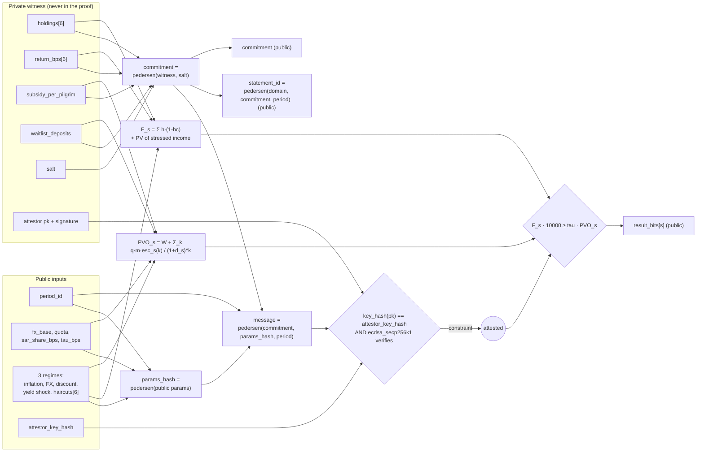

# Circuit logic diagram

The paper's *Demonstration* phase calls for a circuit logic diagram that translates the economic solvency formula into arithmetic constraints.
This is the `hajj_solvency` circuit (`circuits/hajj_solvency/src`).

## Constraints, in order

1. **Range checks** (`model.nr::validate`): every holding, return, subsidy, waitlist value, rate, haircut and FX ratio is bounded, so no free witness value can push arithmetic
   out of range. All intermediates are `u128`; an overflow is an assertion failure, never a silent wrap.
2. **Attestation** (`attest.nr`): recompute `commitment` and `params_hash` from the inputs, derive the message the attestor signs, require `key_hash(pk) == attestor_key_hash` and a valid
   secp256k1 signature. The signature covers the witness *and* every public parameter *and* the period.
3. **Model** (`model.nr`), for each regime *s*:
   * `fx_ratio = ⌈fx_s · 10000 / fx_base⌉`; `blend = ⌈((1−w)·10000 + w·fx_ratio) / 10000⌉`; `base = ⌈q · m · blend / 10000⌉`
   * escalate `H` times by `(1 + π_s)` (ceil), then discount by Horner's rule with `(1 + d_s)` (ceil): `PVO_s = W + PV`
   * `li_i = ⌊h_i · (1 − hc_{s,i}) / 10000⌋`; income `= Σ ⌊li_i · r_i / 10000⌋`; stressed by `(1 − ys_s)`; discounted `H` times (floor): `F_s = Σ li_i + PV`
   * assert `PVO_s > 0`; output `F_s · 10000 ≥ τ · PVO_s`
4. **Outputs**: `result_bits`, `statement_id`, `commitment`.

## Size

4,201 ACIR opcodes, 68,941 backend gates (circuit size 2^17) at H = 10; see `evaluation/results/benchmark.md` for H = 5 to 30.
